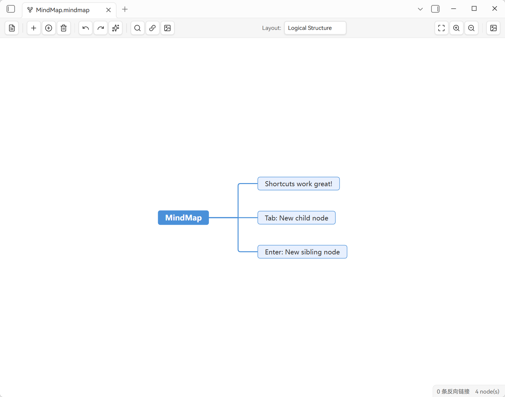

**English | [中文](README.zh-CN.md)**

<div align="center">

# 🧠 The Mind Map

> Mind map rendering for Markdown inside Obsidian. Open `.mindmap.md` — a normal Markdown file — and edit it as a mind map; the Markdown outline round-trips losslessly. Powered by the [simple-mind-map](https://github.com/wanglin2/mind-map) engine, developed by [WinterMosquito](https://github.com/WinterMosquito).

<p align="center">
  
  
  
  
</p>

</div>

---



## ✨ Why The Mind Map

The plugin is a **rendering layer**, not a file-format converter. `.mindmap.md` files are 100% standard Markdown — your notes, links, backlinks, search and Git all work as usual. A Markdown outline is parsed into a mind map; when you edit the map, the changes are written back as Markdown.

## 🚀 Features

- **Markdown-native**: `.mindmap.md` is ordinary Markdown (headings + lists). No proprietary format.
- **Round-trip fidelity**: unedited lines are written back verbatim (frontmatter preserved); headings `#`–`######` map to topic levels 1–6, nested lists to deeper levels.
- **Obsidian-native wikilinks**: `[[note]]` shows as its link text, with hover preview and `Ctrl/Cmd+click` to open; insert-link searches notes and linkable attachments.
- **Images**: vault image suggestions, uniform sizing, and `![[path]]` round-trip.
- **Six layouts**, node search, drag-and-drop, auto-arrange, performance mode for large maps, PNG export.
- **Persistence**: layout, viewport and "open as" preference are kept per file (in plugin data), surviving reopen, rename, and view switching.
- **Center-topic ↔ filename**: editing the central topic renames the `.mindmap.md` file (Obsidian updates links/backlinks).

## 📖 Usage

- **Create**: command/ribbon `New mind map` creates a `思维导图YYYY-MM-DD.mindmap.md` and opens the mind-map view.
- **Open**: use `Open as mind map` (command or file context menu); the file opens in the mind-map view. The last view you chose is remembered.
- **Edit**: add/edit/delete nodes, rearrange, set images/links. Switch back to Markdown via `Edit as Markdown` (restores source/preview mode).
- **Layout/viewport**: preserved per file; `Fit to canvas`, zoom, and arrange are on the toolbar.

The full Markdown ↔ mind-map mapping rules are in [`docs/markdown-mindmap-standard.md`](docs/markdown-mindmap-standard.md).

## 📦 Install

- **Community plugins** (once listed): Settings → Community plugins → search *The Mind Map*.
- **Manual / beta**: copy `main.js`, `manifest.json`, `styles.css` into `<vault>/.obsidian/plugins/mindmap/`, then enable in Settings → Community plugins.

> Requires Obsidian 1.13.0+, desktop (Electron). Config is stored locally (plugin `data.json`); no telemetry.

## 🛠 Development

```bash
npm install
npm run dev      # watch mode
npm run build    # type-check + production bundle (main.js)
npm run lint
```

The engine (`vendor/simple-mind-map.cjs`) is vendored and must not be hand-edited; rebuild from upstream source when upgrading.

## ⚖️ License

MIT — see the `LICENSE` file in the repository root.
