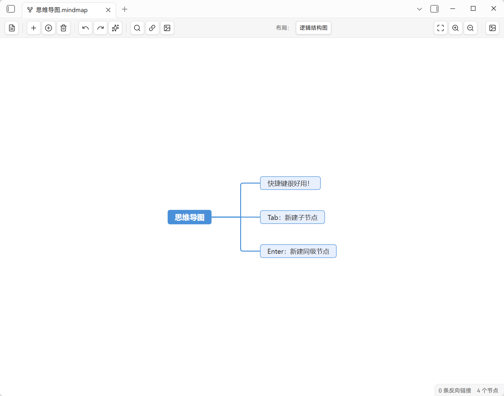

**[English](README.md) | 中文**

<div align="center">

# 🧠 The Mind Map

> 在 Obsidian 中将 Markdown 渲染为思维导图。打开 `.mindmap.md` —— 一个普通的 Markdown 文件 —— 以思维导图编辑；Markdown 大纲可无损往返。基于 [simple-mind-map](https://github.com/wanglin2/mind-map) 引擎，由 [WinterMosquito](https://github.com/WinterMosquito) 开发。

<p align="center">
  
  
  
  
</p>

</div>

---



## ✨ 为什么用 The Mind Map

插件是一个**渲染层**，而非格式转换器。`.mindmap.md` 是 100% 标准 Markdown —— 你的笔记、链接、反向链接、全文搜索与 Git 照常生效。插件把 Markdown 大纲解析为思维导图；你在导图中编辑后，改动会写回为 Markdown。

## 🚀 功能特性

- **纯 Markdown**：`.mindmap.md` 就是普通 Markdown（标题 + 列表），无专有格式。
- **往返保真**：未编辑的行逐字回写（frontmatter 原样保留）；标题 `#`–`######` 对应导图第 1–6 级子主题，缩进列表对应更深层级。
- **Obsidian 原生双链**：`[[笔记]]` 显示为链接文本，支持悬停预览与 `Ctrl/Cmd+点击` 跳转；「插入链接」联想笔记与可链接附件。
- **图片**：库内图片联想、统一尺寸、`![[路径]]` 往返。
- **六种布局**、节点搜索、拖拽排序、自动整理、大图性能模式、PNG 导出。
- **状态持久化**：每个文件的布局、视口与「打开方式」偏好会保存（插件 data.json），重开/改名/切换视图后保持。
- **中心主题 ⇄ 文件名**：修改中心主题会自动重命名 `.mindmap.md` 文件（Obsidian 原生更新链接/反链）。

## 📖 使用说明

- **新建**：命令/丝带「新建思维导图」创建 `思维导图YYYY-MM-DD.mindmap.md` 并进入导图视图。
- **打开**：命令或文件右键「以思维导图打开」；文件在导图视图打开。你最后选择的视图会被记住。
- **编辑**：增删改节点、拖拽、设置图片/链接；「以 Markdown 编辑」随时切回（并恢复进入前的编辑/阅读模式）。
- **布局/视口**：按文件保存；工具栏提供「适应画布」、缩放与自动整理。

完整的 Markdown ↔ 思维导图映射规则见 [`docs/markdown-mindmap-standard.md`](docs/markdown-mindmap-standard.md)。

## 📦 安装

- **社区插件**（上架后）：设置 → 第三方插件 → 搜索 *The Mind Map*。
- **从 GitHub Release 安装（推荐）**：从仓库 [Releases](https://github.com/WinterMosquito/The-Mind-Map/releases) 页面下载最新版本的附件（`main.js`、`manifest.json`、`styles.css`），复制到 `<库>/.obsidian/plugins/mindmap/`，再到「设置 → 第三方插件」启用。
- **从源码构建**：`npm install && npm run build` 生成 `main.js`，与 `manifest.json`、`styles.css` 一起放入插件目录。

> 需要 Obsidian 1.13.0+，桌面端（Electron）。配置仅存本地（插件 `data.json`），无遥测。`main.js` 由 CI 构建并随每个 GitHub Release 发布（不提交进仓库）。

## 🛠 开发

```bash
npm install
npm run dev      # watch 模式
npm run build    # 类型检查 + 生产构建（main.js）
npm run lint
```

引擎（`vendor/simple-mind-map.cjs`）为 vendor 产物，请勿手工编辑；升级时从上游源码重新打包替换。

## ⚖️ 许可证

MIT —— 见仓库根目录 `LICENSE` 文件。
